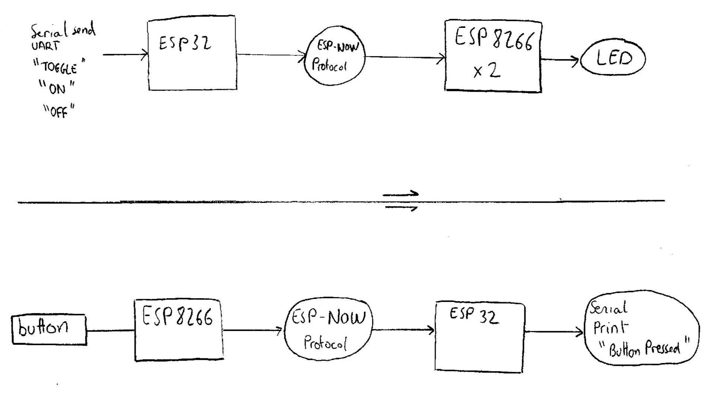

# ESP-NOW USB Gateway

A custom USB key that acts as a **gateway for ESP-NOW** communication instead of Zigbee. This device enables a PC or a Raspberry Pi to send and receive messages via ESP-NOW using a simple **USB-to-Serial** interface.

## Features
- **ESP-NOW Communication**: Enables direct wireless communication between ESP32/ESP8266 devices without requiring a Wi-Fi network.
- **USB-UART Interface**: Connects to a computer via USB and exposes a serial interface for sending and receiving messages.
- **Low Latency**: Utilizes ESP-NOW's fast and efficient transmission (typically <2ms delay).
- **Unicast & Broadcast Support**: Can send messages to specific devices or broadcast to multiple nodes.
- **Compatible with Home Automation**: Easily integrates with Python scripts, MQTT, and Home Assistant.

Below is a rough schematic overview of the project:


## Getting Started

### Hardware Requirements
- ESP32 or ESP8266 as the USB gateway.
- Additional ESP32/ESP8266 devices to communicate with.
- USB-UART adapter (if needed) for serial communication.

### Software Requirements
- **ESP-IDF or Arduino IDE** to program the ESP.
- **Python & PySerial** (for testing communication on PC).

### Current project

1. The ESP8266 listens for messages and toggles an LED based on the received command ("LED_TOGGLE", "LED_ON", or "LED_OFF"). It also sends a message when a button is pressed.
2. The ESP32 waits for input from the user via the serial monitor ("TOGGLE", "ON", "OFF"). Based on the input, it sends a corresponding message to the ESP8266.
3. Both devices use ESP-NOW to send and receive messages with each other, with callbacks handling sending and receiving statuses.
4. The ESP8266 reacts to button presses by sending a message "BUTTON_PRESSED" to the ESP32, and the ESP32 sends commands to control the LED state on the ESP8266.
5. The system allows remote control of the LED on the ESP8266 using the ESP32 through serial inputs.

Below is a rough schematic overview of the current project:



### Installation
1. **Flash the ESP-NOW Gateway Firmware**
   ```bash
   esptool.py --chip esp32 --port /dev/ttyUSB0 write_flash 0x1000 firmware.bin
   ```
2. **Connect to the Gateway via Serial**
   ```python
   import serial
   ser = serial.Serial('/dev/ttyUSB0', 115200)
   ser.write(b'{"cmd": "send", "data": "Hello ESP-NOW!"}\n')
   print(ser.readline().decode().strip())
   ```
3. **Setup ESP-NOW Devices**
   - Flash ESP-NOW code on additional ESP devices.
   - Pair devices by registering their MAC addresses.

## Future Improvements
- **MQTT Integration**: Allow forwarding ESP-NOW messages to an MQTT broker.
- **Security Enhancements**: Implement ESP-NOW encryption for secure communication.
- **Low Power Optimization**: Enable deep sleep for battery-operated devices.

## License
This project is licensed under the MIT License.

## Contributing
Feel free to open issues or submit pull requests to improve the project!

---

🚀 **Let's build a fast and efficient ESP-NOW communication network!**