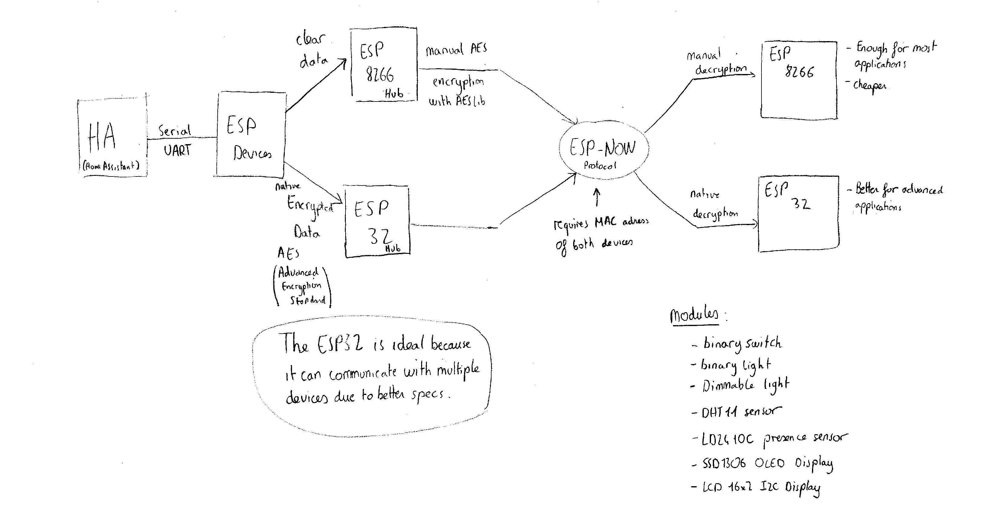

# ESP-NOW USB Gateway

A custom USB key that acts as a **gateway for ESP-NOW** communication instead of Zigbee. This device enables a PC or a Raspberry Pi to send and receive messages via ESP-NOW using a simple **USB-to-Serial** interface.

## Project features
- **ESP-NOW Communication**: Enables direct wireless communication between ESP32/ESP8266 devices without requiring a Wi-Fi network.
- **USB-UART Interface**: Connects to a computer via USB and exposes a serial interface for sending and receiving messages.
- **Low Latency**: Utilizes ESP-NOW's fast and efficient transmission (typically <2ms delay).
- **Compatible with Home Automation**: Easily integrates with Python scripts, and Home Assistant.

Below is a rough schematic overview of the project:



## Hardware Requirements
- **Home Assistant** on a server like a Raspberry pi.
- ESP32 as the USB gateway.
- Additional ESP8266 devices to communicate with.
- USB-UART adapter for serial communication.

## Software Requirements
- **Arduino IDE** to program the ESP.
- **Python & PySerial** (for testing communication on PC).

→ [Here's the steps to configure Arduino for ESP32/ESP8266](Docs/Arduino_ESP32_ESP8266_manual.md)

## Getting Started

### First steps
   
   1. Clone the Project from GitHub using Git (recommended):

      To get the project source code, you'll need to clone the GitHub repository.
      If you have Git installed, open a terminal or command prompt and run:

      ```bash
      git clone https://github.com/pungvincent/ESP-NOW-USB-Gateway.git
      ```
   2. Retrieve MAC Addresses
      To enable communication between ESP devices using ESP-NOW, you first need to obtain the MAC address of each device.
      Use the MAC_Address_ESP32.ino and MAC_Address_ESP8266.ino sketches to retrieve the MAC addresses for the ESP32 and ESP8266, respectively.

      → [Follow the step-by-step guide here](Docs/Get_MAC_Adress_mini_manual.md)

      Once you've successfully retrieved the MAC addresses, you need to insert them into the communication sketches: ESP32_now.ino and ESP8266_now.ino.

      → [Instructions for that are available here](Docs/Set_MAC_Adress_mini_manual.md)

### Modules

#### Output device

This project currently supports the integration of switch relay modules and dimmable light modules, with more device options coming soon.

 1. [Switch/Relay](Docs/SwitchRelay_summary.md)
 2. [Dimmable light](Docs/Dimmable_light_summary.md)

Below is a rough schematic overview of the current project:


#### Input device

This project currently includes a single input device: the button module, used to trigger actions based on physical presses — with additional input types planned for future updates.

1. [Button](Docs/Button_summary.md)

### Installation
1. **Flash the ESP-NOW Gateway Firmware**
   ```bash
   esptool.py --chip esp32 --port /dev/ttyUSB0 write_flash 0x1000 firmware.bin
   ```
2. **Connect to the Gateway via Serial**
   ```python
   import serial
   ser = serial.Serial('/dev/ttyUSB0', 115200)
   ser.write(b'{"cmd": "send", "data": "Hello ESP-NOW!"}\n')
   print(ser.readline().decode().strip())
   ```
3. **Setup ESP-NOW Devices**
   - Flash ESP-NOW code on additional ESP devices.
   - Pair devices by registering their MAC addresses.

## Future Improvements
- **MQTT Integration**: Allow forwarding ESP-NOW messages to an MQTT broker.
- **Security Enhancements**: Implement ESP-NOW encryption for secure communication.
- **Low Power Optimization**: Enable deep sleep for battery-operated devices.

## License
This project is licensed under the MIT License.

## Contributing
Feel free to open issues or submit pull requests to improve the project!

---

🚀 **Let's build a fast and efficient ESP-NOW communication network!**