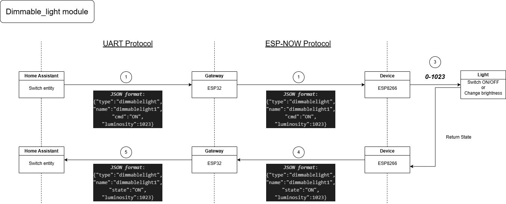

# DimmableLight Module Overview

The `DimmableLight` module provides brightness control for an output device like an LED using PWM. It receives commands via a communication protocol (e.g., ESP-NOW) and adjusts the light intensity accordingly.

---

## ⚙️ Features

- Controls brightness with PWM (Pulse Width Modulation)
- Supports commands to turn ON, OFF, TOGGLE, or set a specific brightness level
- Sends back status and brightness feedback in JSON format

Below is a rough schematic overview of the current module:

---

## 🛠️ How to Use

1. **Initialization**: Create a `DimmableLight` instance with the desired GPIO pin and a unique name.
2. **Setup**: Call `setup()` to configure the pin as an output.
3. **Command Handling**: Use `Received_data()` to handle incoming messages:
   - `"ON"`: Sets maximum brightness (1023)
   - `"OFF"`: Turns the light off (0)
   - `"TOGGLE"`: Currently sets brightness to 0 (can be enhanced)
   - `"LEVEL"`: Sets a custom brightness value using the `Rx_luminosity` argument
4. **Feedback**: After each command, the module sends a JSON message reporting the current state and brightness level.

---

## 📦 Integration

- Designed for use with ESP-NOW or similar communication protocols.
- Ideal for home automation setups needing adjustable lighting.

---

## 🔄 Extendability

Possible extensions include:
- Smooth transitions (fade in/out)
- Saving/restoring previous brightness
- Time-based lighting effects

---
