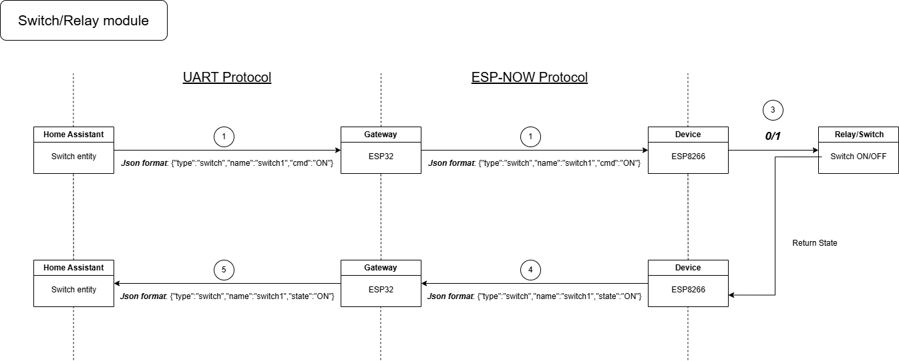

# BinarySwitch & Relay Module Overview

The `BinarySwitch` and `Relay` modules provide basic ON/OFF control for digital output pins. These are typically used to control LEDs, relays, or any binary actuator in an embedded application.

---

## ⚙️ Features

- Simple digital control using HIGH or LOW signal
- Accepts common commands: `"ON"`, `"OFF"`, and `"TOGGLE"`
- Sends feedback as a JSON message indicating the current state

Below is a rough schematic overview of the current module:

---

## 🛠️ How to Use

1. **Initialization**: Create a `BinarySwitch` or `Relay` instance by passing:
   - The GPIO pin to control
   - A unique module name

2. **Setup**: Call the `setup()` method to configure the specified pin as an output.

3. **Command Handling**: Use the `Received_data()` method to handle incoming instructions:
   - `"ON"`: Sets the pin HIGH (turns the output ON)
   - `"OFF"`: Sets the pin LOW (turns the output OFF)
   - `"TOGGLE"`: Flips the current state

4. **Feedback**: After executing a command, the module sends a JSON object with:
   - Type (`"switch"` or `"relay"`)
   - Name of the module
   - Current state (`"ON"` or `"OFF"`)

---

## 📦 Integration

- Compatible with any digital actuator or indicator
- Easily integrated with ESP-NOW communication for wireless control

---

## 🔄 Extendability

- You can add debounce logic or delays for physical switches
- Relay modules can be configured for NO (Normally Open) or NC (Normally Closed) behavior
- Can be grouped or automated via additional logic layers (e.g., timers, schedules, remote triggers)

---
